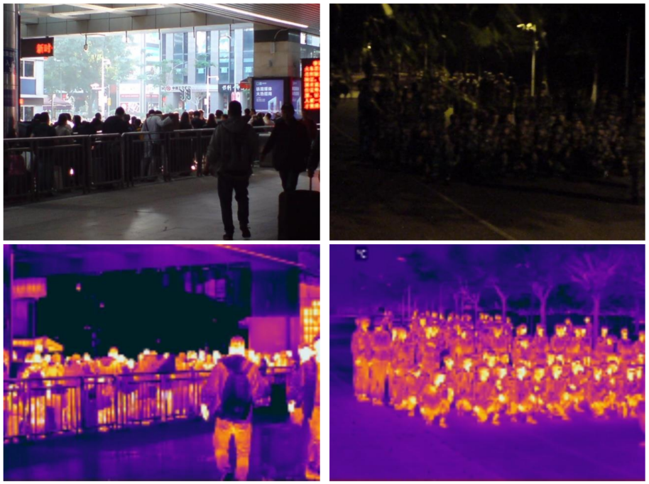
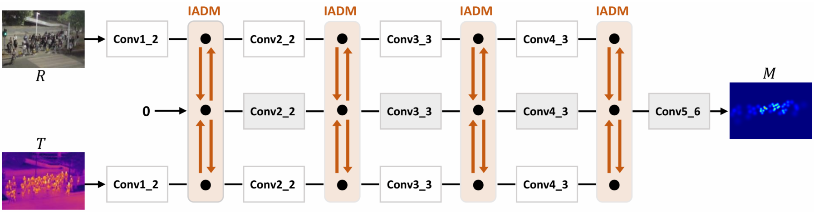
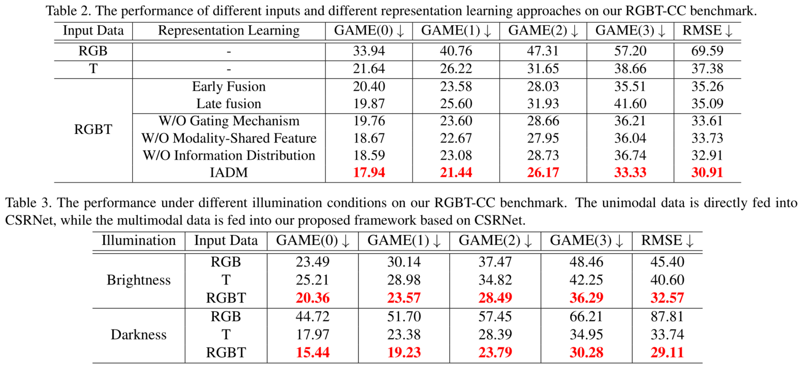
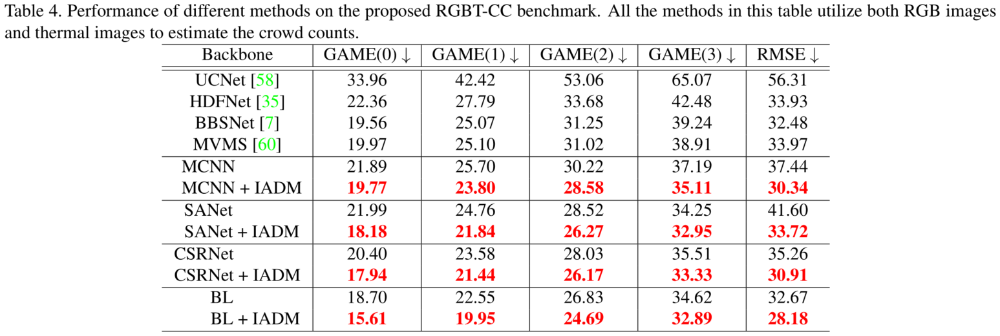

# RGBT Crowd Counting

## Paper

Lingbo Liu, Jiaqi Chen, Hefeng Wu, Guanbin Li, Chenglong Li, Liang Lin. "Cross-Modal Collaborative Representation Learning and a Large-Scale RGBT Benchmark for Crowd Counting." IEEE Conference on Computer Vision and Pattern Recognition (CVPR), 2021. [<a href="https://arxiv.org/abs/2012.04529">PDF</a>] 

RGBT-CC Dataset & Models: [<a href="https://www.dropbox.com/sh/o4ww2f5tv3nay9n/AAA4CfVMTZcdwsFxFlhwDsSba?dl=0">Dropbox</a>][<a href="">BaiduYun (PW: RGBT)</a>]

## Introduction
Crowd counting is a fundamental yet challenging task, which desires rich information to generate pixel-wise crowd density maps. In this work, we find that incorporating optical and thermal information can greatly help to recognize pedestrians. To promote future researches in this field, we introduce a large-scale RGBT Crowd Counting (RGBT-CC) benchmark, which contains 2,030 pairs of RGB-thermal images with 138,389 annotated people. Furthermore, to facilitate the multimodal crowd counting, we propose a cross-modal collaborative representation learning framework, which consists of multiple modality-specific branches, a modality-shared branch, and an Information Aggregation-Distribution Module (IADM) to capture the complementary information of different modalities fully. Specifically, our IADM incorporates two collaborative information transfers to dynamically enhance the modality-shared and modality-specific representations with a dual information propagation mechanism. Extensive experiments conducted on the RGBT-CC benchmark demonstrate the effectiveness of our framework for RGBT crowd counting.

## RGBT-CC Benchmark
To promote the future research of this task, we propose a large-scale RGBT Crowd Counting (RGBT-CC) benchmark. Specifically, this benchmark consists of 2,030 pairs of 640x480 RGB-thermal images captured in various scenarios (e.g., malls, streets, playgrounds, train stations, metro stations, etc). Among these samples, 1,013 pairs are captured in the light and 1,017 pairs are in the darkness. A total of 138,389 pedestrians are marked with point annotations, on average 68 people per image. Finally, the proposed RGBT-CC benchmark is randomly divided into three parts: 1030 pairs are used for training, 200 pairs are for validation and 800 pairs are for testing. Compared with those Internet-based datasets with serious bias, our RGBT-CC dataset has closer crowd density distribution to realistic cities, since our images are captured in urban scenes with various densities. Therefore, our dataset has wider applications for urban crowd analysis.

  

## Method
The proposed RGBT crowd counting framework is composed of three parallel backbones and an Information Aggregation-Distribution Module (IADM). Specifically, the top and bottom backbones are developed for modality-specific (i.e. RGB images and thermal images) representation learning, while the middle backbone is designed for modality-shared representation learning. To fully exploit the multimodal complementarities, our IADM dynamically transfers the specific-shared information to collaboratively enhance the modality-specific and modality-shared representations. Consequently, the final modality-shared feature contains comprehensive information and facilitates generating high-quality crowd density maps.

  

## Experiments

  

  

## More References
Crowd Counting with Deep Structured Scale Integration Network, ICCV 2019 [<a href="https://openaccess.thecvf.com/content_ICCV_2019/papers/Liu_Crowd_Counting_With_Deep_Structured_Scale_Integration_Network_ICCV_2019_paper.pdf">PDF</a>]

Crowd Counting using Deep Recurrent Spatial-Aware Network, IJCAI 2018 [<a href="https://www.ijcai.org/proceedings/2018/0118.pdf">PDF</a>] 

Efficient Crowd Counting via Structured Knowledge Transfer, ACM MM 2020 [<a href="https://dl.acm.org/doi/10.1145/3394171.3413938">PDF</a>]
